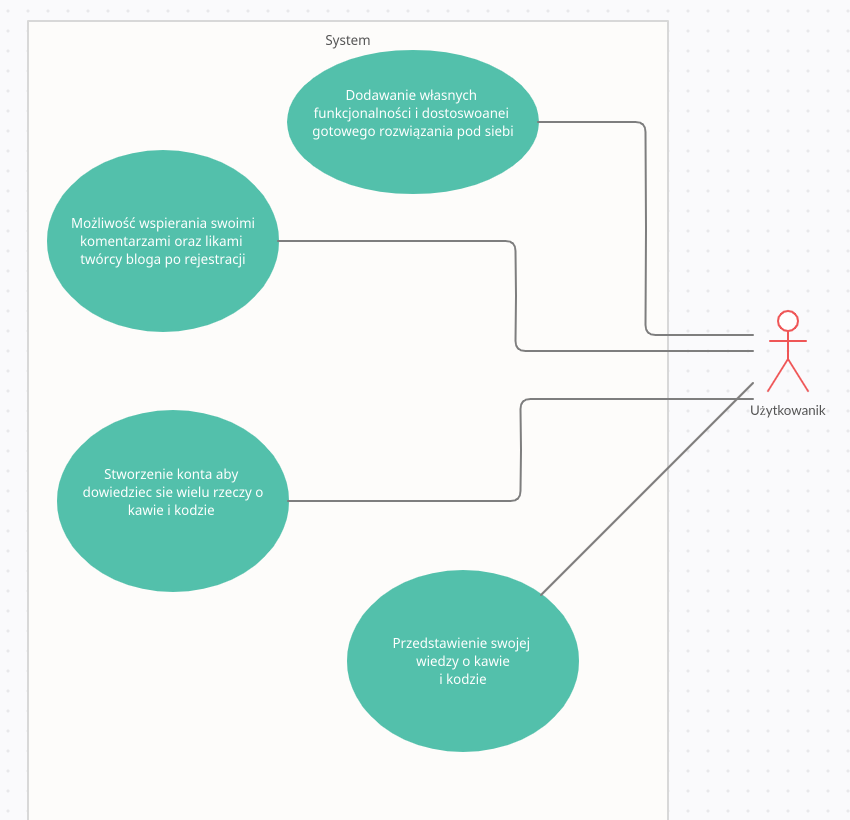
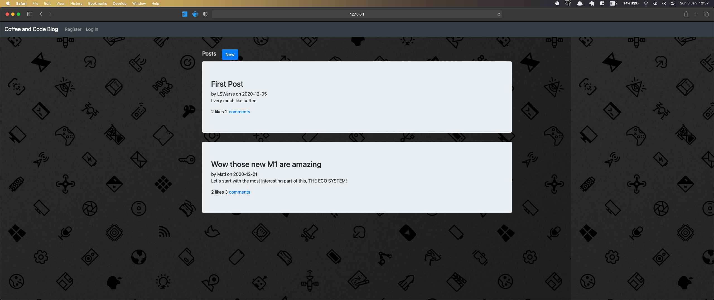
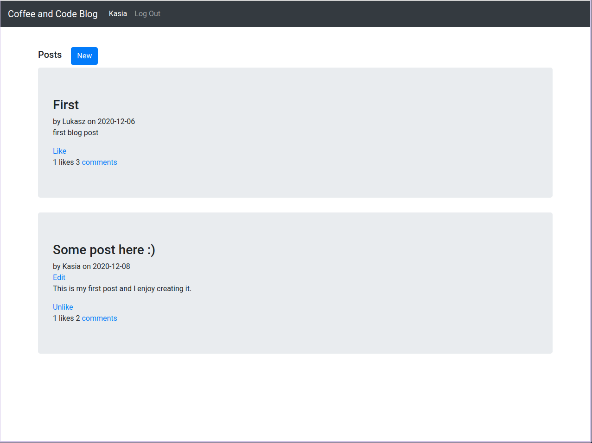
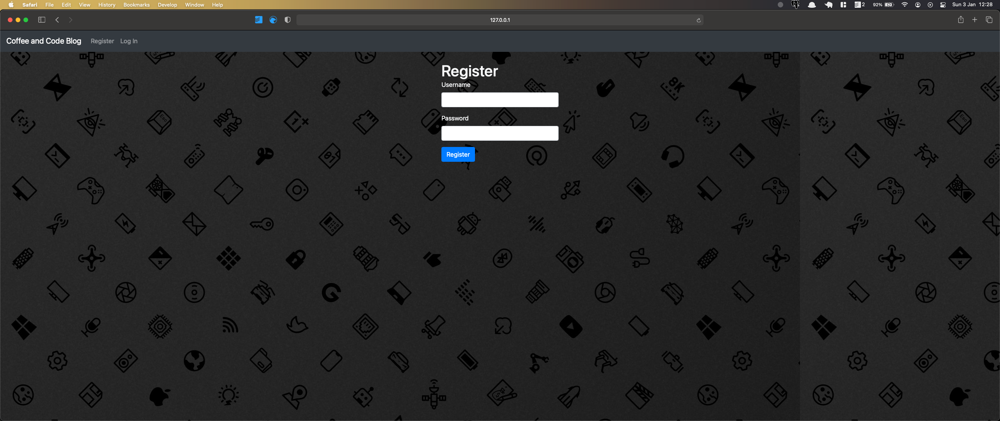
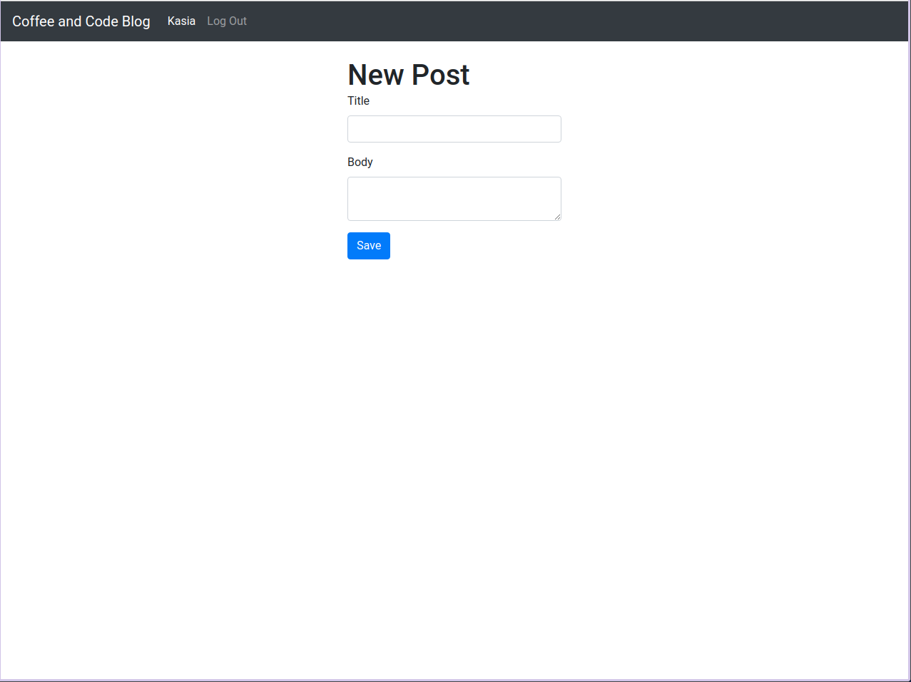
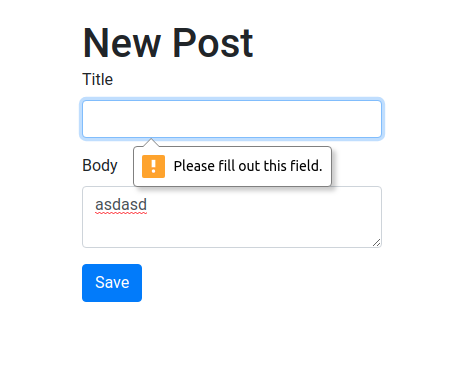
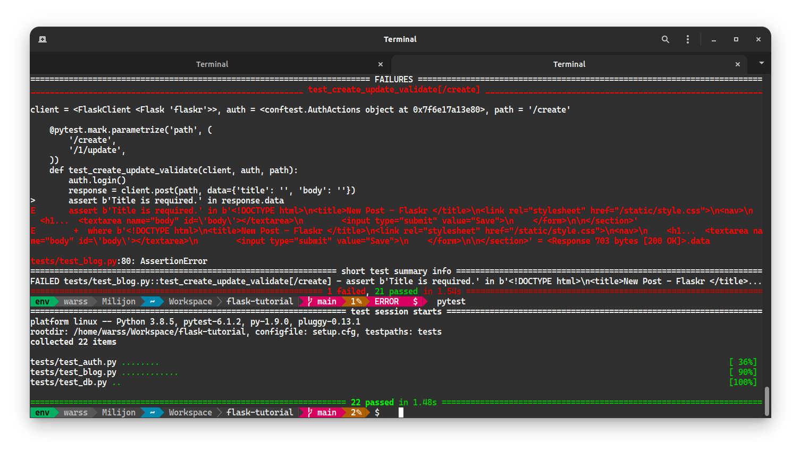

# Dokumentacja projektu na Technologie Internetowe

## Łukasz Stachnik, Informatyka z specjalnością Algorytmika i Programowanie 

### Prowadzący ćwiczenia: mgr Szymon Głowania

### Temat projektu: Platforma blogowa pasjonatów kawy i kodu

[Repozytorium na GitHub]()

#### 1. Opis programu

Program to aplikacja webowa pozwalająca na postawienie własnego bloga o kawie i kodzie. Z autentykacją, zabezpieczeniami zapytań do bazy oraz jeśli chemy też gotowymi ustawieniami pod deployment na Heroku. W skład aplikacji wchodzi strona głowa gdzie widnieją wszystkie posty, do postów można dodawać komentarze, likować czy je edytować jeśli jesteśmy urzytkownikiem który stworzył dany post.
Wszystko jest podpiętę pod bazę postgresSQL, przy użyciu SQL Alchemy dla pythona, co pozwala nam na operowanie na modelach i tworzeniu instacji w bazie danych z poziomu kodu oraz łatwą kontrolę nad migracjami.

#### 2. Diagram przyadków użycia

#### 3. PrtScr projektu z opisami 

To jest główna strona aplikacji jeszcze przed zalogowaniem, Flask daje nam opcje łatwego ukrywania elementów przed zalogowaniem przy użyciu templatów i rozszerzania plików html o elementy z innych pilków html co widać na powyższym obrazku gdyż baza posiada tylko navbar (stylizowany z pomoca boostrapa) a reszta zmienia się zależnie od tego jaką akcje wykonamy.

---

Tutaj widzimy już główna strone po zalogowaniu, urzytkownik może edytować oraz usuwać tylko swoje posty. 

---

To jest strona logowania, przy złym wpisaniu hasła czy nicku pokaże nam się wiadomość że są niepoprawne i mamy je sprawdzić. Dodatkowo hasło jest hashowane w bazie danych także w platformie zadbałem o bezpieczeństwo oraz prywantość użytkownika, po za tym przy wysyłaniu requestów post, używany jest token csrf zabezpieczający jest przed man in the middle attacks z strony hackera.

---

Tutaj bardzo podobny form do rejestracji oczywiście z tymi samymi zabezpieczeniami co w wypadku logowania. Oraz tutaj następuje hasowanie hasła do bazy danych.

---

Ekran tworzenia nowego posta, dostepny dla użytkownika z poziomu strony głownej tylko po zalogowaniu.

---

Wszystkie pola w formularzach na stronie posiadają warningi o tym że mamy wpisać dane by przejść dalej zabezpieczające bazę przed problamami z typem czy też nullami.

---

Aplikacja ma podstawowe testy jednostokowe z użyciem PyTest. 